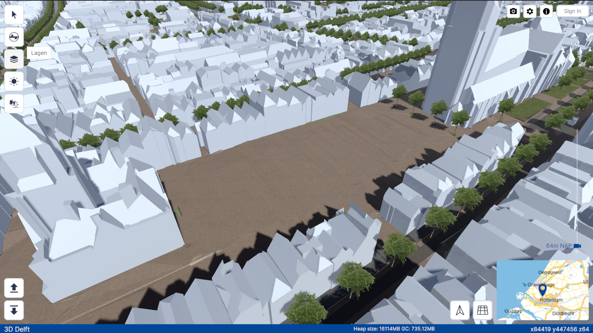
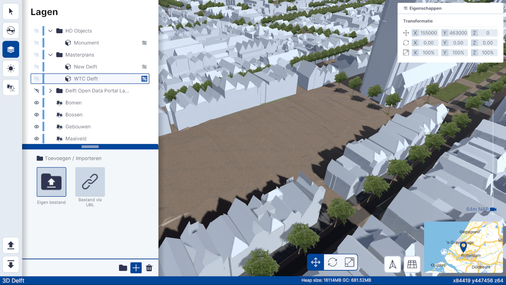
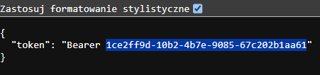
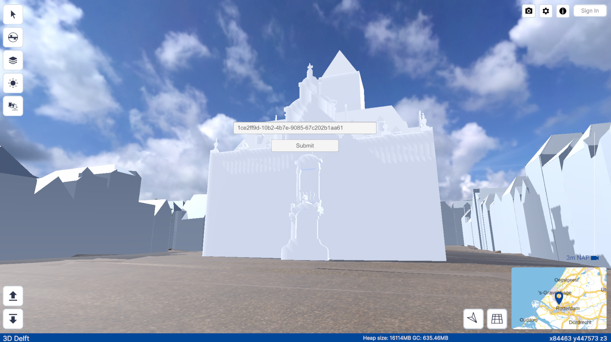
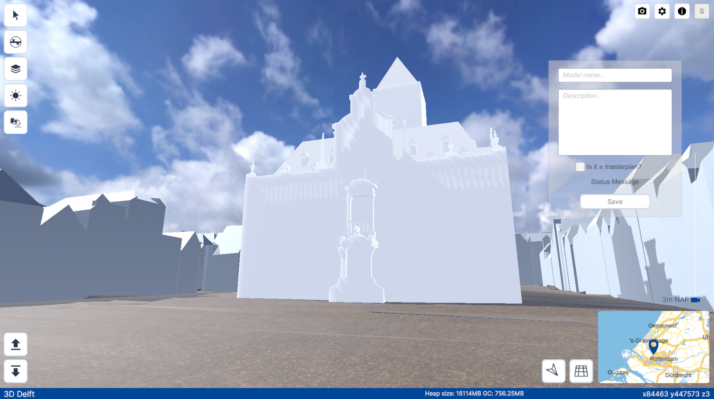
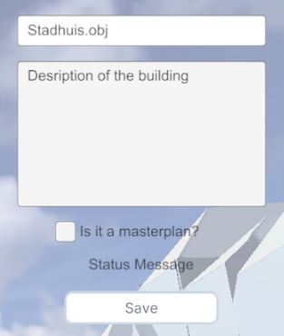

# ObjUpload Quick Start

OBJ uploading and saving functionality is restricted to administrators. To access this functionality, administrators must log in using credentials and retrieve a bearer token for authentication.

Steps 1 and 2 can be performed in any order.

## Step 1. Import and Position OBJ Models

Users can import an OBJ model into the scene, preview, and manipulate its properties, including position, scale, and rotation.

The imported OBJ model will automatically be textured with a default material. This material renders both sides of each mesh face, meaning the orientation of normals does not affect the rendering.

### Navigate to the **Lagen** (Layers) Tab

On the left side of the UI, you will find vertically stacked icons. Open the tab labeled **Lagen** to manage layers.

### Click the **+** Icon to Import Data

At the bottom of the **Lagen** tab, you will find a plus icon (`+`) for adding new data.

### Select **Importeren** and **Eigen Bestand** to Load Your OBJ Model

From the import menu, select **Importeren** (Import) and then choose **Eigen Bestand** (Your Own File) to upload your OBJ model.

### Upload Your OBJ File

After selecting your file, it will be uploaded and displayed in the Unity viewer.

### Position the OBJ Model Correctly

Once uploaded, position your OBJ model within the scene by adjusting its position, rotation, and scale. These settings can be manipulated directly in the viewer.

---

## Step 2. Log In

To begin uploading OBJ files, administrators must authenticate by logging in.

### Click on the **Sign In** Button

In the top-right corner of the viewer UI, there is a **Sign In** button.

### Enter Your Username and Password

A pop-up window will appear, prompting you to enter your administrator credentials.

### Retrieve Your Bearer Token

After successful authentication, the system will generate a bearer token that looks like: `155f1caf-288f-4e9e-9e64-6eef09e60bb1`.

### Copy and Paste the Token

Copy the generated bearer token and paste it into the designated input field within the Unity viewer.

### Access the **Save** Dropdown Menu

Once logged in successfully, the **Sign In** button will change to a **Save** dropdown menu, allowing you to save your OBJ model to the database.

---

## Step 3. Save the OBJ Model to the Database

After positioning the OBJ model, follow these steps to save it to the database:

### Select the Model in the Layer Tab

Click on the model within the layer tab to select it.

### Review or Edit the Model's Name

The model's name will be automatically filled in but can be edited if necessary.

### Add a Description and Indicate **Masterplan** Status

Provide a description for the model and indicate whether it is part of a **Masterplan** by checking the corresponding box.

### Press **Save**

After filling in the required information, press the **Save** button to send the model and its metadata (position, rotation, scale) to the PostgreSQL database.

Upon saving, the model will be accessible in future sessions, with its metadata securely stored in the database.

