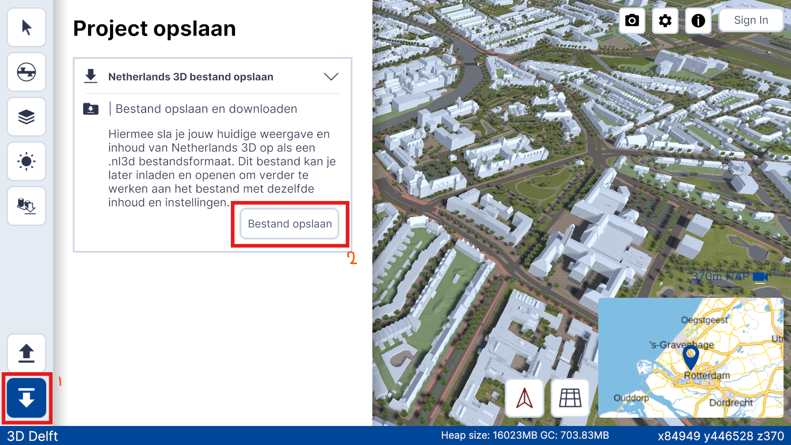

# 3. Configuring to new municipality

## 3.1 Setting Up Origin

The Netherlands 3D framework starts you at the origin of the RDNAP CRS in Amersfoort. However, when setting this up for a new municipality, configuring the framework to start at the desired municipality is convenient. To do so, we will alter the streaming assets of the project.

1. Firstly, run the Netherlands 3D application on the website or clone the Netherlands 3D repository and run it in Unity. You will need Unity to save the new settings and apply them to your application, so our advice would be to start out by running the application in Unity.

2. Inside the running application, go to the municipality or starting viewpoint of your choice.

3. Save your .nl3d project file by clicking the save button in the bottom left corner and then selecting 'Bestand opslaan.' This will save you a .nl3d file.  
   

4. Place the .nl3d file in *Your 3D Project* -> *Assets* -> *StreamingAssets* folder.

5. In your Unity project, go to *Assets* -> *Scenes* and select your main scene or the scene for which you want to change the starting view.

6. In that scene, go to the Hierarchy tab and select the ProjectDataHandler prefab.

7. In the ProjectDataHandler prefab Inspector, change your Default Project File name to the .nl3d file you saved in steps 3 and 4.

8. Go to *File* -> *Build Settings*, and select the scenes you want to include in the *Scenes to Build* box. This usually includes your main scene, the configuration loader, and the setup window.

9. When you now run your project in Unity, or build your application and run it, it will start at the viewpoint where you saved your .nl3d file in step 3.

## 3.2 Area of Interest (AOI)

Since this project is intended for a certain municipality, it is possible to restric the movement of the users to a certain area. This is done by specifying the desired region as a polygon in any GIS software and exporting it as a `geojson` file, named `aoi.geojson`. To apply this area of interes to the project, the `aoi.geojson` have to be uploaded alongside the build files. Read more information on the upload [here](./deployment.md#71-upload-application-files).

### Implementation

The area of interest configureation mananges to restrict the movement by continiusly checking if the position of the Camera Game object is inside the provided polygon. This is done by a simple ray casting algorithm to check the number of intersections between a line throught the position and the polygon. At each frame it is checkd whether the camera is inside the polygon  or not. If it is inside, its positsion is saved. If it is outside, the position of the camera is reverted to the last valid position.

The functionality automatically loads on the startup ofthe appplication. It tries to load the aoi polygon from the same server where the applicaion is hosted, at path `https://server/aoi.geojson`. If there is no such file on the server, the aoi restriction is disabled.

[< Getting Started](./getting-started.md) | [Home](./index.md) | [Next: Loading 2D Layers >](./loading-2D-layers.md)
