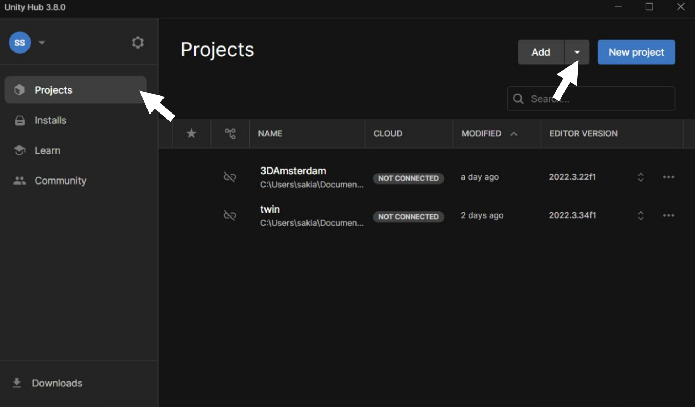

# 2. Getting Started

#### Prerequisites
- If you want to make changes to the structure of the application, you should have a Unity license. For all other changes within the application, running it in your browser is sufficient.

#### Downloading the Correct Version of Unity
Download the Unity Hub installer from [https://unity.com/download](https://unity.com/download) and install the hub. When prompted, do NOT install a specific Unity version.

#### How to Clone Netherlands3D
You can use Git to download the project. Open a terminal window and navigate to the folder where you want to copy the project, then run the following command:

```bash
git clone https://github.com/Netherlands3D/twin.git netherlands
```

This might take some time. It will create a folder containing the project files.

#### Add Netherlands3D as a Project in Unity
1. In the Projects tab of Unity, click on the arrow beside "Add," then select "Add project from disk." Navigate to the recently downloaded folder and choose the project folder.  
   

2. A yellow warning triangle will appear once you add the project. Click on it and then install the missing engine version.
   - **IMPORTANT**: If you do NOT have *Visual Studio Community Edition* installed, make sure to check the respective box under *Dev Tools*.
   - **IMPORTANT**: Also check the box for *WebGL Build Support* under *Platforms*.

3. Once the engine is downloaded, you can open the project.


#### Structure of the Netherlands3D project in Unity (visual diagram)
    - Functionalities
    - Prefab Spawners and how do they work?
    - Cartesian/3D tiles
    - UI
    - File organization
    - Configuring Streaming Assets with saved project (.nl3d) file

[< Introduction](./introduction.md) | [Home](./index.md) | [Next: Configuring Municipality >](./configuring-municipality.md)

[Pages info](./pages/example/pages.md)